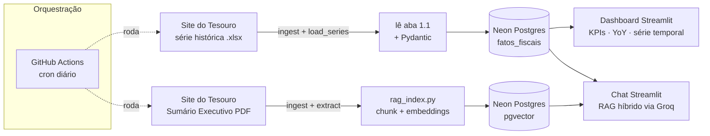

# Pipeline de Dados do RTN — Resultado do Tesouro Nacional (Sumário Executivo)

Um pipeline de dados **totalmente automatizado e de custo zero**, construído em
torno da divulgação mensal do RTN pelo Tesouro Nacional. Ele roda dois fluxos:

- um **fluxo estruturado** — carrega a *planilha oficial de série histórica* do
  Tesouro (`.xlsx`, dados mensais desde 1997) no Postgres para um dashboard
  analítico (série temporal + comparação ano a ano); e
- um **fluxo não estruturado** — indexa o texto do *Sumário Executivo* (PDF) em
  um banco vetorial para um **chatbot RAG híbrido**.

Ambos são servidos por um aplicativo web interativo.

> Construído como projeto de portfólio para demonstrar a evolução da análise de
> dados tradicional para **engenharia de dados moderna + IA aplicada** (RAG sobre
> documentos reais).

---

## Por que este projeto

Relatórios de finanças públicas são publicados em PDF — fáceis para humanos,
difíceis para máquinas. Este pipeline transforma esse material mensal em:

- uma **série temporal** de indicadores fiscais para visualizar em gráficos; e
- um **assistente de perguntas e respostas** ancorado *apenas* no conteúdo do
  próprio relatório (respostas auditáveis e com alucinação minimizada).

Tudo roda de forma agendada, **sem servidores para gerenciar e sem conta de
nuvem** — cada componente fica num plano gratuito generoso.

---

## Arquitetura



O `ingest.py` resolve as URLs de download automaticamente (varre a página de
publicação e segue o `<iframe>` do PDF até o CDN), então nenhum link manual é
necessário. Os dois fluxos são independentes: se um falhar, o outro ainda entrega
valor. O chat é **RAG híbrido** — ancora as respostas tanto nos números curados
(`fatos_fiscais`) quanto no texto do relatório recuperado. Tudo é orquestrado
pelo `pipeline.py`, executado diariamente pelo **GitHub Actions**.

---

## Stack e decisões-chave

| Tema | Escolha | Por quê |
|---|---|---|
| **Fonte estruturada** | **Planilha oficial de série histórica `.xlsx`** (openpyxl) | Dados mensais oficiais desde 1997 — muito mais robusto do que raspar números da prosa, e é cumulativa (um arquivo = histórico inteiro). |
| **Banco de dados** | Neon Postgres + **pgvector** | Uma única instância gerenciada guarda *tanto* os fatos estruturados *quanto* os vetores. Menos peças móveis, plano gratuito generoso. |
| **Embeddings** | **fastembed** (ONNX) — `paraphrase-multilingual-MiniLM-L12-v2` | Roda localmente, é multilíngue (entende português) e **sem PyTorch** — cabe no ~1 GB de RAM do plano gratuito do Streamlit. |
| **LLM (RAG)** | **Groq** — `llama-3.3-70b-versatile` | Inferência rápida no plano gratuito, sem cartão de crédito. |
| **Leitura de PDF** | **pdfplumber** | Preserva o layout de PDFs governamentais digitais (não escaneados). |
| **Chunking** | `RecursiveCharacterTextSplitter` (1000 / 150) | Quebra em fronteiras naturais; a sobreposição evita cortar uma ideia ao meio. |
| **Dashboard** | **Streamlit Community Cloud** | Hospedagem gratuita, deploy automático via Git, UI em Python puro. |
| **Orquestração** | **GitHub Actions** | Cron agendado + disparo manual de graça; nenhum servidor para manter. |
| **Validação** | **Pydantic** | Atua como "porteiro de dados" — números fora do padrão são rejeitados antes de chegar ao banco. |

**Filosofia de design:** serverless / "Git como infraestrutura", etapas
idempotentes (reprocessar um mês *atualiza* em vez de duplicar) e extração
orientada por configuração, para que uma mudança no layout da fonte seja um
ajuste de uma linha.

---

## Funcionalidades

### 📊 Dashboard
- **Cartões de KPI** para o mês selecionado (Receita Total/Líquida, Despesa
  Total, Resultado Primário e Nominal — em R$ bilhões) com **variação ano a ano**.
- **Resultado primário ao longo do tempo** — barras mensais coloridas por sinal
  (superávit verde / déficit vermelho), com filtro por faixa de anos (histórico
  desde 2020).
- **Receita Líquida × Despesa Total** em série temporal.
- **Comparação ano a ano** — a métrica escolhida, no mesmo mês do calendário,
  entre os anos.

### 💬 Chat com o relatório (RAG híbrido)
- Combina duas fontes de contexto: os **números curados** do mês detectado
  (sempre exatos) e os **trechos do texto** do relatório recuperados do pgvector —
  então até perguntas factuais simples são respondidas de forma confiável, com
  explicações qualitativas.
- **Ciente do mês**: detecta o mês na pergunta ("2026-04" ou "abril de 2026"),
  filtra a busca por ele e expande datas numéricas para casar com o texto em
  português.
- Ancorado **apenas** no relatório, minimizando alucinação.

---

## Etapas do pipeline

| Etapa | Arquivo | Responsabilidade |
|---|---|---|
| Ingestão | `src/ingest.py` | Resolve e baixa o `.xlsx` e o PDF do mês (resolução automática de URL; `RTN_PDF_URL` é override opcional). |
| Carga (estruturado) | `src/load_series.py` | Lê a aba da série histórica, valida com Pydantic e faz **upsert** em `fatos_fiscais`. |
| Extração | `src/extract.py` | Extrai o texto limpo do PDF para o fluxo RAG. |
| Indexação (não estruturado) | `src/rag_index.py` | Quebra o texto em chunks, gera embeddings (fastembed) e grava os vetores no pgvector. |
| Consulta | `src/rag_query.py` | RAG híbrido: detecção de mês + fatos estruturados + texto recuperado → Groq. |
| Backfill (RAG) | `scripts/backfill_rag.py` | Indexa uma faixa de meses passados para o chat cobrir o histórico. |
| Orquestração | `pipeline.py` | Roda os dois fluxos; sai com erro só se *ambos* falharem. |

---

## Rodando localmente

> Requer **Python 3.12** (o conjunto de dependências mira o 3.12; wheels mais
> novos do fastembed/ONNX para 3.13+ não estão fixados aqui).

```bash
# 1. Crie e ative um ambiente virtual em 3.12
py -3.12 -m venv .venv
.venv\Scripts\activate            # Windows
# source .venv/bin/activate       # macOS/Linux

# 2. Instale as dependências
pip install -r requirements.txt

# 3. Configure os segredos
cp .env.example .env              # depois preencha DATABASE_URL e GROQ_API_KEY

# 4. Uma vez: crie o schema no Neon (rode sql/schema.sql no SQL editor do Neon)

# 5. Rode o pipeline para um mês (baixa .xlsx + PDF e carrega os dois fluxos)
python pipeline.py --mes 2026-04

# 6. (opcional) Backfill do texto RAG para uma faixa de meses
python scripts/backfill_rag.py 2024-05 2026-04

# 7. Suba o app
streamlit run app/streamlit_app.py
```

**Onde obter as chaves gratuitas:**
- `DATABASE_URL` — string de conexão do [Neon](https://neon.tech), com o prefixo
  do driver psycopg3: `postgresql+psycopg://...`
- `GROQ_API_KEY` — [Groq Console](https://console.groq.com/keys)

---

## Deploy

### Execuções automáticas — GitHub Actions
O `.github/workflows/pipeline.yml` roda **diariamente** (09:00 UTC) e também pode
ser disparado manualmente (com `--mes` opcional). Sem `--mes`, o pipeline detecta
o **mês publicado mais recente** e o carrega de forma idempotente — então a
maioria dos dias é um "no-op" barato e, quando um novo RTN sai, ele é capturado
em até 24h. Adicione estes **secrets** do repositório (Settings → Secrets and
variables → Actions):

- `DATABASE_URL` e `GROQ_API_KEY` (e, opcionalmente, `RTN_PDF_URL` para fixar um
  PDF específico; desnecessário, já que a URL é resolvida automaticamente).

### Aplicativo web — Streamlit Community Cloud
Aponte o Streamlit Cloud para `app/streamlit_app.py`, adicione os mesmos valores
em **Secrets** e — importante — **defina a versão do Python como 3.12** nas
configurações avançadas do app (o wheel fixado do `fastembed` exige < 3.13).

---

## Estrutura do projeto

```
projeto_rtn/
├── src/
│   ├── config.py            # configuração central (variáveis de ambiente)
│   ├── ingest.py            # resolve + baixa .xlsx e PDF
│   ├── load_series.py       # série histórica .xlsx → fatos_fiscais
│   ├── models.py            # FatoFiscal (Pydantic) + upsert em fatos_fiscais
│   ├── extract.py           # PDF → texto limpo
│   ├── rag_index.py         # texto → pgvector
│   └── rag_query.py         # RAG híbrido (fatos + texto → Groq)
├── app/
│   └── streamlit_app.py     # dashboard + chat
├── scripts/
│   └── backfill_rag.py      # indexa uma faixa de meses passados para o chat
├── sql/
│   └── schema.sql           # tabela estruturada + extensão pgvector
├── .github/workflows/
│   └── pipeline.yml          # cron diário
├── pipeline.py              # orquestrador
└── requirements.txt
```

---

## Roteiro (roadmap)

- [x] Resolução automática das URLs de download (sem links manuais).
- [x] Carga da série histórica (desde 2020) para série temporal + YoY.
- [x] Backfill do texto RAG por vários meses; chat híbrido e ciente do mês.
- [ ] Asserções de qualidade de dados (ex.: receita líquida − despesa ≈ resultado primário).
- [ ] Testes unitários leves para o leitor da planilha e a detecção de mês.

---

## Licença

MIT — veja o arquivo `LICENSE`.
