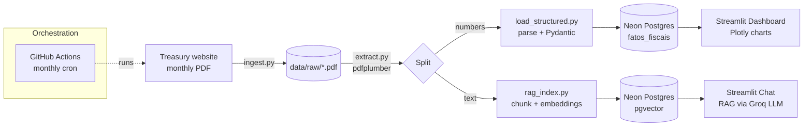

# RTN Data Pipeline — Brazilian Treasury Result (Sumário Executivo do RTN)

An end-to-end, **fully automated and zero-cost** data pipeline that ingests the
Brazilian National Treasury's monthly *Executive Summary* (a government PDF),
splits it into a **structured track** (numbers → analytics dashboard) and an
**unstructured track** (text → RAG chatbot), and serves both through an
interactive web app.

> Built as a portfolio project to demonstrate the move from traditional data
> analysis to **modern data engineering + applied AI** (RAG over real documents).

---

## Why this project

Public-finance reports are published as PDFs — easy for humans, hard for
machines. This pipeline turns that monthly PDF into:

- a **time series** of fiscal indicators you can chart, and
- a **question-answering assistant** grounded *only* in the report's own text
  (so answers are auditable and hallucination is minimized).

It runs on a schedule with **no servers to manage and no cloud bill** — every
component sits on a generous free tier.

---

## Architecture



The whole thing is orchestrated by `pipeline.py`, executed monthly by
**GitHub Actions**. The two tracks are independent: if one fails, the other
still delivers value.

---

## Tech stack & key decisions

| Concern | Choice | Why |
|---|---|---|
| **Database** | Neon Postgres + **pgvector** | One managed instance holds *both* the structured facts and the embeddings. Fewer moving parts, generous free tier. |
| **Embeddings** | **fastembed** (ONNX) — `paraphrase-multilingual-MiniLM-L12-v2` | Runs locally, multilingual (handles Portuguese), and **no PyTorch** — fits the ~1 GB RAM of Streamlit's free tier. |
| **LLM (RAG)** | **Groq** — `llama-3.3-70b-versatile` | Fast inference on a free tier, no credit card. |
| **PDF parsing** | **pdfplumber** | Preserves layout of digital (non-scanned) government PDFs. |
| **Chunking** | `RecursiveCharacterTextSplitter` (1000 / 150) | Splits on natural boundaries; overlap avoids cutting an idea in half. |
| **Dashboard** | **Streamlit Community Cloud** | Free hosting, Git auto-deploy, Python-native UI. |
| **Orchestration** | **GitHub Actions** | Free scheduled cron + manual trigger; no server to run. |
| **Validation** | **Pydantic** | Acts as a "data gatekeeper" — bad numbers are rejected before they reach the DB. |

**Design philosophy:** serverless / "Git-as-infra", idempotent steps (re-running
a month *updates* rather than duplicates), and config-driven extraction so a
change in the source layout is a one-line fix.

---

## Features

### 📊 Dashboard
- KPI cards for the selected month — the headline **primary balances** the
  report states as absolute figures (in R$ billion, signed: surplus +, deficit −):
  Central Government, Treasury + Central Bank (consolidated), Social Security
  (RGPS), plus the year-to-date accumulated balances.
- Time-series charts that accumulate as the monthly cron runs.
- Raw-data table for transparency.

### 💬 Ask-the-report chat (RAG)
- Retrieval-Augmented Generation: the question is embedded, the most relevant
  chunks are pulled from pgvector, and the LLM answers **using only that
  context**, citing the reference month.

---

## Pipeline stages

| Step | File | Responsibility |
|---|---|---|
| 1. Ingest | `src/ingest.py` | Download the monthly PDF (scraper + manual-URL fallback). |
| 2. Extract | `src/extract.py` | Pull clean text and raw tables from the PDF. |
| 3. Load (structured) | `src/load_structured.py` | Parse Brazilian-format numbers, validate with Pydantic, **upsert** into `fatos_fiscais`. |
| 4. Index (unstructured) | `src/rag_index.py` | Chunk text, embed, store vectors in pgvector. |
| Query | `src/rag_query.py` | LCEL RAG chain used by the chat. |
| Orchestrate | `pipeline.py` | Run everything; independent tracks; non-zero exit only if *both* fail. |

---

## Running locally

> Requires **Python 3.12** (the dependency set targets 3.12; newer fastembed/ONNX
> wheels for 3.13+ are not pinned here).

```bash
# 1. Create and activate a 3.12 virtual environment
py -3.12 -m venv .venv
.venv\Scripts\activate            # Windows
# source .venv/bin/activate       # macOS/Linux

# 2. Install dependencies
pip install -r requirements.txt

# 3. Configure secrets
cp .env.example .env              # then fill in DATABASE_URL and GROQ_API_KEY

# 4. One-time: create the schema in Neon (run sql/schema.sql in the Neon SQL editor)

# 5. Run the pipeline for a given month
python pipeline.py --mes 2024-05

# 6. Launch the app
streamlit run app/streamlit_app.py
```

**Where to get the free keys:**
- `DATABASE_URL` — [Neon](https://neon.tech) connection string, using the
  psycopg3 driver prefix: `postgresql+psycopg://...`
- `GROQ_API_KEY` — [Groq Console](https://console.groq.com/keys)

---

## Deployment

### Automated runs — GitHub Actions
`.github/workflows/pipeline.yml` runs on the 5th of each month (09:00 UTC) and
can also be triggered manually (with an optional `--mes`). Add these repository
**secrets** (Settings → Secrets and variables → Actions):

- `DATABASE_URL`, `GROQ_API_KEY`, and optionally `RTN_PDF_URL`.

### Web app — Streamlit Community Cloud
Point Streamlit Cloud at `app/streamlit_app.py`, add the same values under
**Secrets**, and — importantly — **set the Python version to 3.12** in the app's
advanced settings (the pinned `fastembed` wheel requires < 3.13).

---

## Project structure

```
projeto_rtn/
├── src/
│   ├── config.py            # central config (env vars)
│   ├── ingest.py            # 1) download PDF
│   ├── extract.py           # 2) PDF → text + tables
│   ├── load_structured.py   # 3) numbers → fatos_fiscais (Pydantic)
│   ├── rag_index.py         # 4) text → pgvector
│   └── rag_query.py         #    RAG chain (retrieval + Groq)
├── app/
│   └── streamlit_app.py     # dashboard + chat
├── sql/
│   └── schema.sql           # structured table + pgvector extension
├── .github/workflows/
│   └── pipeline.yml         # monthly cron
├── pipeline.py              # orchestrator
└── requirements.txt
```

---

## Roadmap

- [ ] Data-quality assertions (e.g. revenue − expenditure ≈ primary result).
- [ ] Backfill several historical months to enrich the time series.
- [ ] Lightweight tests for the BR-number parser and the extraction patterns.

---

## License

MIT — see `LICENSE`.
