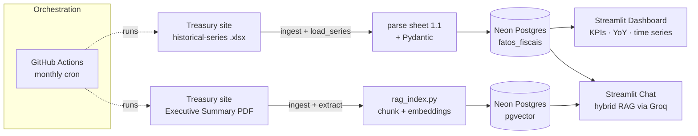

# RTN Data Pipeline — Brazilian Treasury Result (Sumário Executivo do RTN)

An end-to-end, **fully automated and zero-cost** data pipeline built around the
Brazilian National Treasury's monthly RTN release. It runs two tracks:

- a **structured track** — loads the Treasury's official *historical-series
  spreadsheet* (`.xlsx`, monthly data since 1997) into Postgres for an analytics
  dashboard (time series + year-over-year), and
- an **unstructured track** — indexes the *Executive Summary* PDF text into a
  vector store for a **hybrid RAG chatbot**.

Both are served through an interactive web app.

> Built as a portfolio project to demonstrate the move from traditional data
> analysis to **modern data engineering + applied AI** (RAG over real documents).

---

## Why this project

Public-finance reports are published as PDFs — easy for humans, hard for
machines. This pipeline turns that monthly PDF into:

- a **time series** of fiscal indicators you can chart, and
- a **question-answering assistant** grounded *only* in the report's own text
  (so answers are auditable and hallucination is minimized).

It runs on a schedule with **no servers to manage and no cloud bill** — every
component sits on a generous free tier.

---

## Architecture



`ingest.py` resolves the monthly download URLs automatically (it scrapes the
publication page and follows the PDF's `<iframe>` to the CDN), so no manual
links are needed. The two tracks are independent: if one fails, the other still
delivers value. The chat is **hybrid RAG** — it grounds answers on both the
curated numbers (`fatos_fiscais`) and the retrieved report text.

The whole thing is orchestrated by `pipeline.py`, executed monthly by
**GitHub Actions**. The two tracks are independent: if one fails, the other
still delivers value.

---

## Tech stack & key decisions

| Concern | Choice | Why |
|---|---|---|
| **Structured source** | Official **historical-series `.xlsx`** (openpyxl) | Authoritative monthly data since 1997 — far more robust than scraping numbers from prose, and it's cumulative (one file = full history). |
| **Database** | Neon Postgres + **pgvector** | One managed instance holds *both* the structured facts and the embeddings. Fewer moving parts, generous free tier. |
| **Embeddings** | **fastembed** (ONNX) — `paraphrase-multilingual-MiniLM-L12-v2` | Runs locally, multilingual (handles Portuguese), and **no PyTorch** — fits the ~1 GB RAM of Streamlit's free tier. |
| **LLM (RAG)** | **Groq** — `llama-3.3-70b-versatile` | Fast inference on a free tier, no credit card. |
| **PDF parsing** | **pdfplumber** | Preserves layout of digital (non-scanned) government PDFs. |
| **Chunking** | `RecursiveCharacterTextSplitter` (1000 / 150) | Splits on natural boundaries; overlap avoids cutting an idea in half. |
| **Dashboard** | **Streamlit Community Cloud** | Free hosting, Git auto-deploy, Python-native UI. |
| **Orchestration** | **GitHub Actions** | Free scheduled cron + manual trigger; no server to run. |
| **Validation** | **Pydantic** | Acts as a "data gatekeeper" — bad numbers are rejected before they reach the DB. |

**Design philosophy:** serverless / "Git-as-infra", idempotent steps (re-running
a month *updates* rather than duplicates), and config-driven extraction so a
change in the source layout is a one-line fix.

---

## Features

### 📊 Dashboard
- **KPI cards** for the selected month (Total/Net Revenue, Total Expenditure,
  Primary and Nominal Result — in R$ billion) with **year-over-year deltas**.
- **Primary result over time** — monthly bars colored by sign (surplus green /
  deficit red), with a year-range filter (history since 2020).
- **Net Revenue × Total Expenditure** time series.
- **Year-over-year comparison** — the chosen metric for the same calendar month
  across years.

### 💬 Ask-the-report chat (hybrid RAG)
- Combines two context sources: the **curated numbers** for the detected month
  (always exact) and the **report text chunks** retrieved from pgvector — so even
  simple factual questions are answered reliably, with qualitative explanations.
- **Month-aware**: detects a month in the question ("2026-04" or "abril de 2026"),
  filters retrieval to it, and expands numeric dates to match the Portuguese text.
- Grounded **only** on the report, minimizing hallucination.

---

## Pipeline stages

| Step | File | Responsibility |
|---|---|---|
| Ingest | `src/ingest.py` | Resolve & download the monthly `.xlsx` and PDF (auto URL resolution; `RTN_PDF_URL` optional override). |
| Load (structured) | `src/load_series.py` | Parse the historical-series sheet, validate with Pydantic, **upsert** into `fatos_fiscais`. |
| Extract | `src/extract.py` | Pull clean text from the PDF for the RAG track. |
| Index (unstructured) | `src/rag_index.py` | Chunk text, embed (fastembed), store vectors in pgvector. |
| Query | `src/rag_query.py` | Hybrid RAG: month detection + structured facts + retrieved text → Groq. |
| Backfill (RAG) | `scripts/backfill_rag.py` | Index a range of past months so the chat covers history. |
| Orchestrate | `pipeline.py` | Run both tracks; non-zero exit only if *both* fail. |

> `src/load_structured.py` (parsing the figures out of the PDF prose) is kept as
> an alternative extractor, but the dashboard is fed by the spreadsheet, which is
> consistent across the full history.

---

## Running locally

> Requires **Python 3.12** (the dependency set targets 3.12; newer fastembed/ONNX
> wheels for 3.13+ are not pinned here).

```bash
# 1. Create and activate a 3.12 virtual environment
py -3.12 -m venv .venv
.venv\Scripts\activate            # Windows
# source .venv/bin/activate       # macOS/Linux

# 2. Install dependencies
pip install -r requirements.txt

# 3. Configure secrets
cp .env.example .env              # then fill in DATABASE_URL and GROQ_API_KEY

# 4. One-time: create the schema in Neon (run sql/schema.sql in the Neon SQL editor)

# 5. Run the pipeline for a given month (downloads .xlsx + PDF, loads both tracks)
python pipeline.py --mes 2026-04

# 6. (optional) Backfill RAG text for a range of months
python scripts/backfill_rag.py 2024-05 2026-04

# 7. Launch the app
streamlit run app/streamlit_app.py
```

**Where to get the free keys:**
- `DATABASE_URL` — [Neon](https://neon.tech) connection string, using the
  psycopg3 driver prefix: `postgresql+psycopg://...`
- `GROQ_API_KEY` — [Groq Console](https://console.groq.com/keys)

---

## Deployment

### Automated runs — GitHub Actions
`.github/workflows/pipeline.yml` runs on the 5th of each month (09:00 UTC) and
can also be triggered manually (with an optional `--mes`). Add these repository
**secrets** (Settings → Secrets and variables → Actions):

- `DATABASE_URL` and `GROQ_API_KEY` (and optionally `RTN_PDF_URL` to pin a
  specific PDF; not needed since the URL is resolved automatically).

### Web app — Streamlit Community Cloud
Point Streamlit Cloud at `app/streamlit_app.py`, add the same values under
**Secrets**, and — importantly — **set the Python version to 3.12** in the app's
advanced settings (the pinned `fastembed` wheel requires < 3.13).

---

## Project structure

```
projeto_rtn/
├── src/
│   ├── config.py            # central config (env vars)
│   ├── ingest.py            # resolve + download .xlsx and PDF
│   ├── load_series.py       # historical-series .xlsx → fatos_fiscais
│   ├── extract.py           # PDF → clean text
│   ├── load_structured.py   # (alt) parse numbers from PDF prose
│   ├── rag_index.py         # text → pgvector
│   └── rag_query.py         # hybrid RAG (facts + text → Groq)
├── app/
│   └── streamlit_app.py     # dashboard + chat
├── scripts/
│   └── backfill_rag.py      # index a range of past months for the chat
├── sql/
│   └── schema.sql           # structured table + pgvector extension
├── .github/workflows/
│   └── pipeline.yml         # monthly cron
├── pipeline.py              # orchestrator
└── requirements.txt
```

---

## Roadmap

- [x] Auto-resolve download URLs (no manual links).
- [x] Load full historical series (since 2020) for time series + YoY.
- [x] Backfill RAG text across months; hybrid, month-aware chat.
- [ ] Data-quality assertions (e.g. net revenue − expenditure ≈ primary result).
- [ ] Lightweight unit tests for the spreadsheet parser and month detection.

---

## License

MIT — see `LICENSE`.
